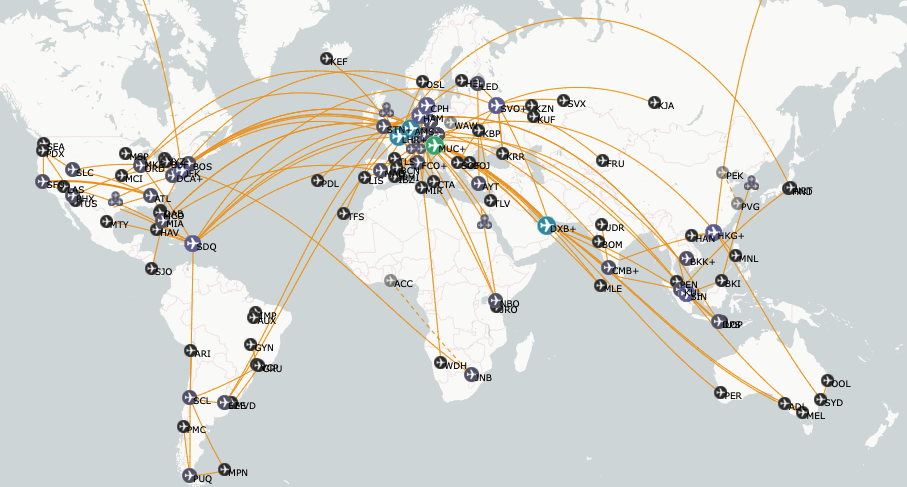
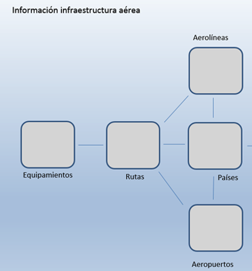
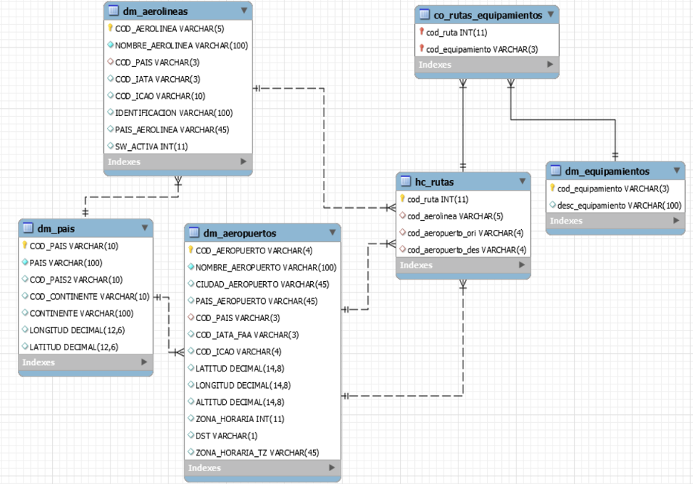

# Knowledge consolidation project for ETLs, DataWarehouse design, Pandas and SQL using aerospacial DATA

  

The aim of the project is to design and create an ETL process to a MySQL cloud db from clever-cloud and query the data using Python.

The use case of this project is the worlwide aerospace routes. The data is extracted from [openflights](https://openflights.org)

## The DW design is as follows:

  

  

